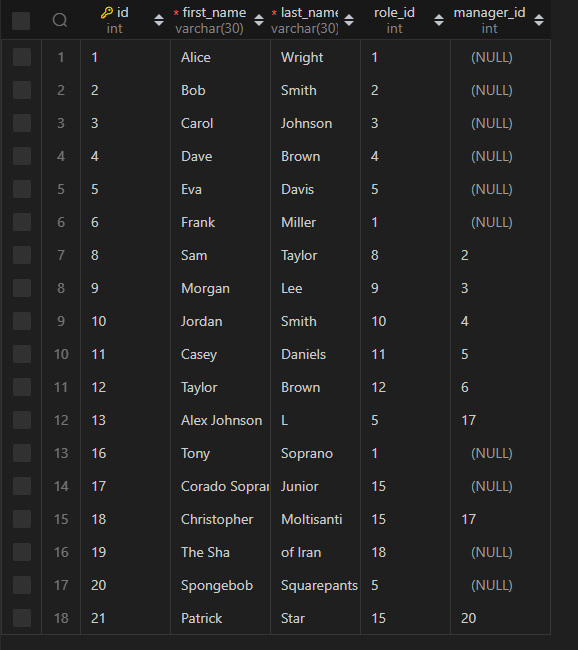
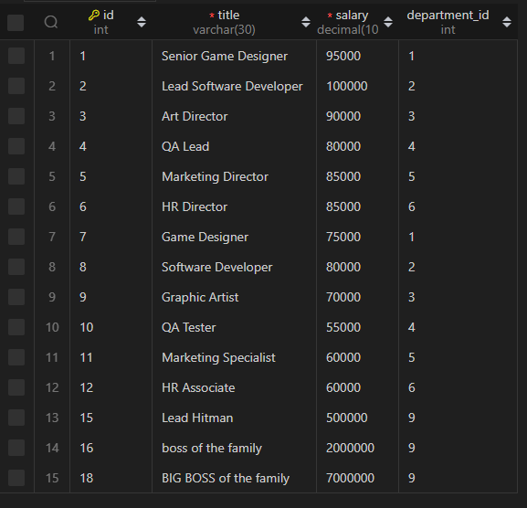

# <strong>alghaibbs SQL Employee Tracker

## Table Of Contents

- [Description](#description)
- [Screenshot](#screenshot)

- [Installation](#installation)
- [Usage](#usage)
- [Contributing](#contribution)
- [Tests](#tests)
- [Portfolio](#portfolio)
- [License](#license)

 

## Description

The SQL Employee Tracker is a Node.js command-line application that leverages a MySQL database to manage employee information for a company. It provides an intuitive interface for users to interact with the employee database, allowing them to view, add, update, and delete employee records, roles, departments, and more.

<a href="#table-of-contents">Back to Table of Contents</a>

### Motivation

The SQL Employee Tracker is designed to streamline the management of employee information within an organization. It offers a user-friendly interface for handling various HR tasks, such as viewing and managing employee roles, departments, and salaries. The system simplifies HR processes, improves data organization, and provides a cost-effective alternative to commercial HR software. This project is ideal for small to medium-sized businesses seeking an efficient way to manage their workforce data.

<a href="#table-of-contents">Back to Table of Contents</a>

### Why I Built This

As a developer, I created the SQL Employee Tracker to streamline the management of employee data in a more efficient and systematic way. My motivation was to solve the practical challenges in HR management, such as maintaining accurate employee records and handling various aspects like roles, departments, and salaries. This project not only simplifies data management but also aims to improve operational efficiency in HR tasks, reflecting my focus on creating practical, user-friendly solutions in the workplace.

<a href="#table-of-contents">Back to Table of Contents</a>

### Problem Solved

The SQL Employee Tracker project addresses the challenge of efficiently managing and organizing employee data. It simplifies tasks such as tracking employee roles, departments, and salaries, and allows for easy updating and retrieval of employee information, thereby enhancing overall HR management efficiency.

<a href="#table-of-contents">Back to Table of Contents</a>

### What I Learned

While developing the SQL Employee Tracker project, I gained practical experience in database management and SQL operations. I learned how to create and manipulate MySQL databases, including creating tables and establishing relationships between them. I also enhanced my skills in writing complex SQL queries for data insertion, updating, deletion, and retrieval. Additionally, I developed proficiency in integrating SQL databases with Node.js applications using mysql2 and inquirer packages, improving my backend development skills. This project likely also honed my problem-solving abilities, as I navigated various challenges and debugged issues in my code.

<a href="#table-of-contents">Back to Table of Contents</a>

## Screenshot

[Video demonstration](https://www.youtube.com/watch?v=IRswYekCi-M&ab_channel=nomxxn)

   
  Live Sreenshot GIF

   

  

<a href="#table-of-contents">Back to Table of Contents</a>

## Technologies

<a href="#table-of-contents">Back to Table of Contents</a>

## Installation

To get the SQL Employee Tracker up and running on your local machine, follow these steps:

1.  Clone the Repository

    - First, clone this repository to your local machine using Git.

      `git clone https://github.com/alghaibb/sql-employee-tracker.git`

2.  Install Node.js

    - Ensure that Node.js is installed on your machine. If not, download and install it from [Node.js website](https://nodejs.org/).

3.  Set Up MySQL

    - Install MySQL on your machine if it's not already installed. You can download it from the [MySQL website](https://www.mysql.com/).
    - Set up a MySQL server and note down your user credentials and server details.

4.  Install Dependencies

    - Navigate to the project directory in your terminal and run:

      `npm install`

    - This will install all necessary dependencies, including `mysql2` and `inquirer`.

5.  Database Setup

    - Log into your MySQL server:

      `mysql -u [your-username] -p [your-password]`

    - Execute the provided schema (`schema.sql`) and seeds (`seeds.sql`) files to set up the database and initial data.

6.  Configuration

    - Update the database connection configuration in `server.js` with your MySQL server details, including host, port, user, and password.

7.  Start the Application

    - Run the application using the command:

      `node server.js`

8.  Use the Application

    - The application will start and prompt you with a series of options to manage employees, roles, and departments in your database.

Ensure that each step is followed carefully for a successful installation and execution of the project.

<a href="#table-of-contents">Back to Table of Contents</a>

## Usage

The SQL Employee Tracker is a command-line application designed to manage a company's employee database using Node.js, Inquirer, and MySQL. Here's how it is used:

1. **Starting the Application**:

- Upon launching the application, users are greeted with a main menu presented through the command-line interface. This is facilitated by the `cfonts` library for an enhanced visual appeal.

2. **Navigating Options**:

- The main menu, powered by `Inquirer.js`, presents various options including viewing departments, roles, and employees; adding departments, roles, and employees; updating employee roles; assigning managers; and deleting departments, roles, or employees.

3. **Viewing Data**:

- Users can view lists of all departments, roles, and employees. These lists are displayed in a table format for easy reading.

4. **Adding Data**:

- New departments, roles, and employees can be added to the database. Users input details like department names, role titles and salaries, and employee names and roles through a series of prompts.

5. **Updating Data**:

- The application allows updating existing employee roles and assigning managers to employees. This is crucial for maintaining an up-to-date record as company structures change.

6. **Deleting Data**:

- Users have the option to delete departments, roles, or employees from the database, catering to the dynamic nature of employee management.

7. **Budget Analysis**:

- A unique feature is viewing the total utilized budget of a department, which calculates the combined salaries of all employees in a department.

8. **Exiting the Application**:

- The application can be exited at any time by choosing the "Exit" option, which safely closes the database connection.

This application is particularly useful for HR departments, team leads, or managers who need an efficient way to track and manage employee information, roles, and departments within an organization. Its command-line interface makes it accessible without the need for a graphical user interface, streamlining the data management process.

<a href="#table-of-contents">Back to Table of Contents</a>

## Contribution

Thank you for considering contributing to the SQL Employee Tracker project! To maintain the quality and functionality of the application, please follow these guidelines for contributing:

1. **Familiarize with the Project**:

- Before contributing, please take some time to familiarize yourself with the project's codebase and functionality. Understanding the existing structure and features is crucial for meaningful contributions.

2. **Issue Reporting**:

- If you find bugs or have suggestions for new features or improvements, please report them as issues on the project repository. Be specific and clear in your descriptions.

3. **Branching**:

- If you're working on a new feature or fixing a bug, create a new branch from the main branch. Branch names should be descriptive and reflect the feature or fix you're working on.

4. **Coding Standards**:

- Write clean, readable, and well-documented code. Follow existing coding conventions in the project for consistency.

5. **Testing**:

- Thoroughly test any new features or bug fixes in your local development environment. Ensure that your changes do not break existing functionality.

6. **Pull Requests**:

- Once you're ready to submit your changes, create a pull request to the main branch. In your pull request description, explain the changes you made and why they are necessary or beneficial.

7. **Code Reviews**:

- After submitting a pull request, it might be reviewed and discussed. Be open to feedback and willing to make changes if requested.

8. **Stay Up to Date**:

- Regularly pull changes from the main branch to keep your local branch up to date and avoid merge conflicts.

9. **Respect the Community**:

- Be respectful and considerate in your interactions with other contributors. We strive to maintain a welcoming and inclusive community.

By following these guidelines, you help to ensure that the SQL Employee Tracker remains a reliable and effective tool for managing employee data. We appreciate your contributions to making this project better!

<a href="#table-of-contents">Back to Table of Contents</a>

## Tests

To ensure the SQL Employee Tracker application functions as expected, follow these testing instructions:

1. **Initial Setup**:

- Clone the repository to your local machine.

- Install all necessary dependencies by running `npm install`.

2. **Database Setup**:

- Set up your MySQL database using the provided schema and seed files. Ensure that your MySQL server is running.

- Update the database connection settings in `server.js` to match your local environment (host, user, password, and database name).

3. **Start the Application**:

- Run the application using the command `node server.js`.

- Verify that the application connects to the database successfully and displays the main menu.

4. **Functionality Tests**:

- Test each menu option to ensure they function as expected:

- Add, view, and delete departments, roles, and employees.

- Assign managers to employees.

- Update employee roles.

- View employees by manager and department.

- Calculate the total utilized budget of a department or all departments.

- For each action, check the database to ensure the changes are correctly implemented.

5. **Error Handling**:

- Intentionally input incorrect or incomplete data to verify that the application handles errors gracefully without crashing.

- Test edge cases, such as deleting a department that has roles assigned or removing an employee currently set as a manager.

6. **Performance**:

- Assess the response time and performance of the application, especially when handling large datasets.

7. **Console Log Review**:

- Monitor the console for any unexpected errors or warnings during the application's operation.

8. **Feedback and Reporting**:

- Document any issues or bugs encountered during testing. Include steps to reproduce the issue, expected results, and actual results.

- Provide feedback or suggestions for improvement.

Regular testing is crucial for maintaining the reliability and usability of the SQL Employee Tracker. Your thorough testing and feedback are invaluable in identifying and resolving potential issues.

<a href="#table-of-contents">Back to Table of Contents</a>

## Portfolio

Visit my portfolio:
[Visit my portfolio](https://alghaibb-portfolio.vercel.app/)

<a href="#table-of-contents">Back to Table of Contents</a>

## License

This application is covered under the following licence:

